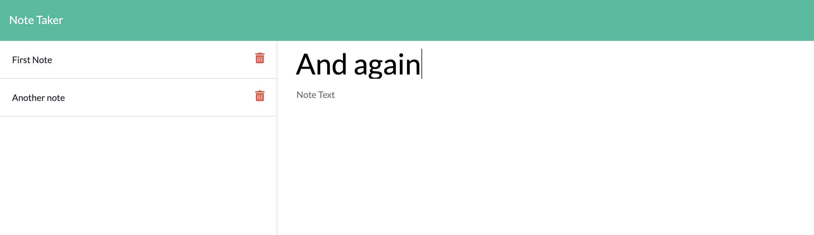

# Note Taker App

This web application saves notes onto a server for users to view and edit whenever they would like. 

## Installation

Clone folder onto your own computer by forking the repository and using the "Clone or download" button on github.

Install all npm modules using the command "npm install"

Run the server by calling node server.js from the commandline open in the root folder to host the website locally.

## Front-end Functionality

### Saving and deleting notes
The code to add and delete nodes was provided by Triology. Users can type new notes into the application and save these to view on future visits. They can delete notes from the note list. 

### Note Editing
The provided code was modified so that users can also edit previously saved notes. Upon clicking on a saved note in the note list, the note is rendered as editable. After editting, the user can save the note using the save button like before. However, this time, the updated version will replace the previous note when viewed.

## Server-Side Functionality 

### Server Setup 
This application uses an express server to deliever its content. 

### HTML Routing
The server routes different web addresses to deliever the various webpages on the site. Users can view the application at "/notes", the api of saved notes at "/api/notes", or the homepage by visiting any other path. 

### API Routing and data Storage
Working with the front-end api calls, the server routes api calls to get, post, and delete notes. 

When called to get notes from the api, the server returns all note objects. 

When a post is made, the posted note is compared to stored notes to see if a new note is being made or an edit by comparing ids. If it is an edit, the posted note will replace the old note. If it is a new note without an id, a unique id will be assigned and the note object will be added to the array of stored objects. The new array of notes is written into the file db.json to be stored and used later, regardless of if the server is stopped and restarted. 

When a delete call is routed, the id of the requested note is compared to the stored notes' ids. When a match is found, the notes data is removed from the list and the editted data is saved in a rewritten db.json file. 

## Coding

*  The provided code uses html, css, javascript, jquery, ajax, and bootstrap. 

*   Modifications to the provided code where made using javascript
*   This project utilizes node and various node packages: 
*   Express is used to create and set up the server.
*   FileSystem is used to read and write the db.json file for note storage. 
*   Path is used to determine route paths for the different files. 

## Meta 

Jamie Kook - kookjc6@gmail.com

Web Application: 
[https://evening-scrubland-32842.herokuapp.com/](https://evening-scrubland-32842.herokuapp.com/)

Github Repo: 
[https://github.com/JamieKook/Note-Taker](https://github.com/JamieKook/Note-Taker)

